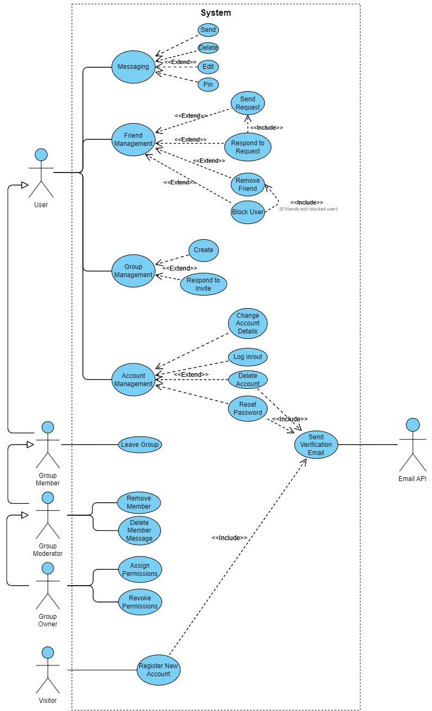

# COSC 310 Project - Discord Clone

## Team Bamboozlers

### Members

| Student Name       | Student Number | Github Username |
|--------------------|----------------|-----------------|
| Bridgette Hunt     | 43214485       | bhunt02         |
| MacKenzie Richards | 47753504       | mrichards03     |
| Zahra Kagda        | 90484528       | zkagda          |
| Ryan Osmond        | 66398421       | Phoenix78911    |
| Ben Norton         | 98964356       | Bawnorton       |

### Brief Description of the Software
A messaging platform, designed to offer an intuitive and comprehensive communication experience. This platform facilitates individual and group interactions through direct messaging and chat groups. Users can create accounts, manage friends lists, and form or join groups for shared communication. Additionally, the platform empowers users with moderator roles, enabling them to manage group dynamics, such as member permissions and content oversight. 

### User Groups and Example Scenarios

1. **Casual Users**
   - **Scenario:** John signs up to stay in touch with his friends. He creates a group chat for his close friends where they share updates, plan events, and chat daily. John enjoys the ease of adding friends and the intuitive chat interface that keeps his social circle connected.

2. **Business Teams**
   - **Scenario:** A small startup uses the platform for internal communication. They create several groups for different projects, and team leads are assigned as moderators. This setup allows for efficient project management, quick updates, and seamless collaboration among team members, all within a secure and organized platform.

3. **Educators and Students**
   - **Scenario:** A high school teacher, Mr. Thompson, sets up groups for his classes where he can share assignments, announcements, and educational resources. He uses the moderator role to manage student interactions and ensure the space remains focused on learning. Students use the platform to ask questions and collaborate on projects.

4. **Event Organizers**
   - **Scenario:** Linda, an event organizer, creates a group for an upcoming conference. She uses the platform to share updates, manage RSVPs, and facilitate discussions among attendees. As a moderator, Linda highlights important messages and manages participant interactions, making the platform an essential tool for event planning and communication.

## Requirements

### What the project is:

Discord Clone

### Description:

Our project will be a Messaging Platform allowing users to create accounts, add friends and create groups with or send and receive messages to/from. It will also allow users to become moderators of groups and control members permissions within said groups.

### 1. Introduction

#### 1.1 Purpose of the Requirements Document

The purpose of this document is to outline the user requirements and the functional purpose of the Discord Clone, a messaging platform. It will serve as a comprehensive guide for the development team to understand what features and functionalities are required, ensuring that the final product aligns with user expectations and project objectives.

#### 1.2 Scope of the Product

The Discord Clone is a messaging platform that enables users to create accounts, add friends, form groups, and communicate through messages. It also includes features for users to act as moderators in groups, managing member permissions and overseeing group activities.

#### 1.3 Definitions, Acronyms, and Abbreviations

-   **User**: An individual who interacts with the Discord Clone platform.
-   **Moderator**: A user with elevated permissions within a group to manage members and settings.
-   **Group**: A chat environment where multiple users can communicate simultaneously.
-   **DM (Direct Message)**: A direct message sent from one user to another.

#### 1.4 References

Discord: <https://discord.com/>

#### 1.5 Overview of the Remainder of the Document

The remainder of this document is divided into sections detailing the general description of the product, specific requirements including functional and non-functional aspects, followed by appendices and an index for easy navigation.

### 2. General Description

#### 2.1 Product Perspective

The Discord Clone is an independent product, designed to provide an intuitive, user-friendly messaging experience. It aims to incorporate the best features of existing messaging platforms while introducing unique functionalities tailored to user needs.

#### 2.2 Product Functions

-   Account creation and management
-   Friend list management
-   Group creation and management
-   Messaging (both private and group)
-   Moderator roles and permissions in groups

#### 2.3 User Characteristics

Users are individuals seeking a communication platform. They range from casual users who want to keep in touch with friends to businesses, teachers, and group leaders who need to manage large groups.

#### 2.4 General Constraints

-   The platform must ensure data privacy and security.
-   It should be scalable to accommodate a growing number of users.

#### 2.5 Assumptions and Dependencies

-   Continuous internet connectivity for users.

### 3. Specific Requirements

#### 3.1 User Requirements
-   Users should be able to register for a new account.
-   Users should be able to log in to an existing account with their username and password.
-   Users should be able to change their username, email, display name, avatar, and password, in addition to the ability to delete their accounts permanently.
-   Users must be able to add and remove friends.
-   Users should be able to accept and/or deny friend requests from other users.
-   Users should be able to remove existing friends.
-   Users should be able to block other users.
-   Users should be able to directly message their friends in one-on-one chats.
-   Users should be able to create group chats in which they can invite and message multiple other users concurrently.
-   Group Owners and Moderators should be able to invite/remove group members 
-   Group Owners should be able to assign Group Moderator status to other group members
-   Group Owners and Moderators should be able to remove messages sent by other group members
-   Users should be able to send, receive, edit, pin, and delete messages

#### 3.2 Functional Requirements
- The system should send a confirmation email when a new account is created.
- When a new account is created, the system should save the username, email, and an encrypted version of the password in a new row in the Users table in the database.
- The system should send a confirmation email when a user changes their email. If verified, the system should edit the changed detail in the relevant row in the Users table in the database.
- The system should require password verification when a user attempts to change their username or password. If the correct password is entered, the system should edit the changed detail in the relevant row in the Users table in the database.
- When a new chat is created, the system should create a new row in the Chats table with a descriptor to differentiate between Direct Message and Group Chats.
- When a user sends a Group Invite, the system should create a new row in the GroupInvites table.
- When a user accepts a Group invite, the system should add that user to the ChatUser table under the relevant Chat ID.
- When a user is removed from a group, the system should remove that user from the ChatUser table under the relevant Chat ID.
- When a user clicks on the Find Friend tab, the system should display a search bar that shows a matching query of the relevant users from the database.
- When a user clicks on the Direct Messages tab, the system should display  an open direct messages tab and any existing chats a user may have as pulled from the Chats table.
- When a user clicks on the Open Direct Messages tab, the system should display a list of all the user's existing friends as pulled from the Friendships table with a button Send Message next to each friend's name.
- When a user clicks on the Send Message tab, the system should check the Chats table to see if a direct message chat between these 2 users already exists, if it does, the system should redirect the user to that chat. Otherwise, it should create a new row in the Chats table in the database and create a new tab with the friends' name and avatar, if any, within the Direct Message dropdown.
- The system must update the corresponding FriendRequest row and add a Friendship row into the specified tables when a user accepts/denies a friend request.
- When a user is blocked, the system should remove the relevant rows in the Friendship Table, GroupInvites table, and FriendRequests table, and add a row to the Blocked table.
- The system must add a new row in the Messages table in the database when a user sends a message.
- The system must edit the relevant columns of the Messages table in the database when a user deletes, pins, or edits a message
- The system must update the relevant rows in the ChatModerators table if owners change the permissions of users.

#### 3.3 Non-Functional Requirements

-   **Performance & Reliability**: The system should be able to handle multiple users performing system functions such as messaging, registering, friend requesting, etc.
-   **Scalability**: The system should accommodate a growing number of users and groups while maintaining performance and reliability.
-   **Security**: The system should include robust security measures to protect user data and privacy. This entails policies such as email verification when activating an account, and safe password and email storing through hashing methods.

### 4. Appendix

#### 4.1 Use Case UML Diagrams

#### 4.2 Detailed Use Cases

<table>
<tr>
    <th>Use Case</th>
    <th>Details</th>
    <th>Scenarios</th>
</tr>
<tr>
<td>Use Case 1. Messaging</td>
<td>

* Primary Actor: Registered User
* Precondition: User is registered and logged in
* Postcondition: Varies

</td>
<td>
1. User navigates to and opens a direct message chat or a group message chat
        <table>
<tr>

a) Send Message
1. User types a message and presses enter or "Send" button
2. Server takes message and saves it in the database
3. Message is distributed via server to recipients
4. Message is displayed for all involved clients

<ins>Extensions</ins>
1. User attempts to send a message to another user they are not friends with
*System issues an error message to the user and informs them they cannot send messages to non friends

   
</tr>
<tr>

b) Attaching Media
1. User clicks on a paperclip icon and selects a file from their device
2. Server takes file and saves it in the database
3. Message with file is distributed via server to recipients
4. Message with file is displayed for all involved clients

<ins>Extensions</ins>
1. User inserts unsupported file type
* System issues an error message and requests user to attach a supported file type

</tr>
<tr>

c) Delete Message
1. User opens hamburger menu on message they've sent and clicks delete
2. User confirms they want to delete the message
3. Server locates message in database and deletes it
4. Message is removed from display for all involved clients

</tr>
<tr>

d) Edit Message
1. User opens hamburger menu on message they've sent and clicks edit
2. User makes edits to message and confirms them
3. Server locates message in database and modifies it
4. Message is edited in display for all involved clients

</tr>
<tr>

e) Pin Message
1. User clicks on a thumbtack icon and confirms they want to pin the message
2. The server locates and marks the message as pinned in the database
3. Message is displayed in a toggle-able tab with the list of pinned messages for all involved clients

</tr>
</table>
</td>
</tr>
<tr>
<td>Use Case 2. Manage Friends</td>
<td>

* Primary Actor: Registered User
* Precondition: User is registered and logged in
* Postcondition: Varies

</td>
<td>
<table>
<tr>

a) Send Friend Request
1. User navigates to and opens "Friends" tab
2. User clicks "Add friend" button and searches the username of their friend
3. User finds their profile and sends them a friend request
4. The friend request is stored in the database by the server
5. The friend sees the pending request in their own "Friends" tab

<ins>Extensions</ins>
1. User attempts to send a friend request to an existing friend
* System informs user that this is already an existing friend

2. User cancels the friend request
* Server removes the outgoing friend request from the database

</tr>

<tr>

b) Accept Friend Request
1. User navigates to and opens "Friends" tab
2. User navigates to "Pending" tab
3. User clicks on checkmark button and confirms the friend request
4. Server deletes friend request from the database
5. Server adds the new friendship between users to database
6. Server opens a new direct chat between the users

</tr>
<tr>

c) Remove Friend
1. User navigates to friend profile
2. User clicks "Remove Friend" and confirms their choice
3. Server removes friendship from the database
4. Neither user is able to message each other anymore, but their direct chat is preserved

</tr>
<tr>

d) Block User
1. User navigates to another user's profile
2. User opens hamburger menu, selects "Block User" and confirms their choice
3. Server adds the blockship to the database
4. Neither user can send friend requests to each other
5. The blocked user cannot see the profile of the user and the user cannot see messages sent by the blocked user

<ins>Extensions</ins>
1. User was friend with the blocked user 
* Server removes the user's friendship with the blocked user from the database
2. User had pending friend request from the blocked user 
* Server removes the pending friend request from the database
3. User had outgoing friend request to the blocked user 
* Server removes the outgoing friend request from the database

</tr>
</table>
</td>
</tr>
<tr>
<td>Use Case 3. Manage Groups</td>
<td>

* Primary Actor: Registered User
* Precondition: User is registered and logged in
* Postcondition: Varies

</td>
<td>
<table>
<tr>

a) Create Group
1. User clicks on "Create Group" button and inputs details, confirming their choice
2. Server takes request and creates a new Group and GroupChat
3. Server sets the user as the Owner, and adds a corresponding GroupModerator and GroupMember row
3. User now sees the Group in their list of groups

</tr>
<tr>

b) Join Group
1. User navigates to "Groups" tab and opens "Invites" menu
2. User accepts invite to group
3. Server adds User as a GroupMember
4. User now sees the Group in their list of groups

</tr>
<tr>

c) Leave Group
1. User navigates into Group settings page and selects "Leave Group," confirming their choice
2. Server takes request and removes User from Group, removing corresponding database entries
3. User no longer sees the group in their list of groups

c) <ins>Extensions</ins>
1. User is the Group Owner
   * Server assigns the oldest appointed GroupModerator as the new Owner 

</tr>
</table>
</td>
</tr>
<tr>
<td>Use Case 4. Manage Group Members</td>
<td>

* Primary Actor: Group Moderator or Owner
* Precondition: User is assigned Group Moderator or is a Group Owner, User is registered and logged in
* Postcondition: Varies

</td>
<td>
<table>
<tr>

a) Invite Member(s)
1. Group Moderator selects "Invite" option when in Group Settings
2. Group Moderator selects one or more of their friends to invite
3. Server saves invitations to the database and distributes to the invited users

</tr>
<tr>

b) Remove Group Member
1. Group Moderator navigates to Member List, selects "Remove member" on a member, and confirms their choice
2. Server deletes corresponding rows for User and notifies both the removed user and the group chat that the user was removed
3. Removed user no longer sees the Group in their list of Groups

</tr>
<tr>

c) Delete Member Message
1. Group Moderator selects a member's message and opens the hamburger menu, selecting "delete"
2. Server takes request and deletes the message from the database
3. All clients in the group remove the message from view

</tr>
<tr>

d) Assigning Permissions
1. Group Owner selects a member in the member list, selects "Assign moderator", and confirms their decision
2. Server adds corresponding GroupModerator row for the Group Member
3. New Moderator can now see moderator options and privileges

</tr>
<tr>

e) Removing Permissions
1. Group Owner selects a moderator in the member list, selects "Revoke moderator", and confirms their decision
2. Server removes corresponding GroupModerator row for the Group Member
3. Member can no longer see moderator options and privileges

</tr>
</table>
</td>
</tr>
<tr>
<td>Use Case 5. Account Management</td>
<td>

* Primary Actor: Registered User
* Precondition: Varies
* Postcondition: Varies

</td>
<td>
<table>
<tr>

a) Log Into Account
1. Registered User navigates to website home page on browser
2. User enters their credentials and confirms them
3. Server checks credentials against database and opens an authenticated logged-in session
4. User is redirected to their landing page

<ins>Extensions</ins>
1. User enters incorrect credentials
*System issues an error and informs user their credentials are incorrect

</tr>
<tr>

b) Log Out of Account
1. Registered, logged-in User navigates to their settings
2. User selects log out
3. Server ends the authenticated logged-in session
4. User is redirected to the website home page

</tr>
<tr>

c) Change Username
1. Registered, logged-in User navigates to their settings, then to account details
2. User selects "change username" and enters a new username, confirming it
3. Server checks the new username against database entries
4. Server changes the username in the database if there are no conflicts
5. User's profile representation changes in all views for all other users and themselves

<ins>Extensions</ins>
1. User selects a username that is already in use
*System issues and error and requests user to select another username

</tr>
<tr>

d) Change Avatar
1. Registered, logged-in User navigates to their settings, then to account details
2. User selects "change avatar" and selects a new avatar, confirming it
3. Server saves the new avatar in the database
4. User's profile representation changes in all views for all other users and themselves

</tr>
<tr>

e) Change Description
1. Registered, logged-in User navigates to their settings, then to account details
2. User selects "change description" and types a new description, confirming it
3. Server saves the new description in the database
4. User's profile representation changes in all views for all other users and themselves

<ins>Extensions</ins>
1. User attempts to enter a description beyond the allotted length
*System prevents user from continuing to input characters and displays the maximum number of characters in red

</tr>
<tr>

f) Change Password
1. Registered, logged-in User navigates to their settings, then to account details
2. User selects "change password" enters their old password and a new password twice, confirming it
3. Server sends a validation email to their registered email and awaits response
4. User navigates to email and confirms by clicking the link
5. Server changes the password in the database for the user and redirects the user back to settings

</tr>
<tr>

g) Reset Password
1. Registered User selects "Reset Password" from log-in screen
2. Server sends email with Reset Password link to user's registered email
3. User navigates to email and confirms by clicking the link
4. User enters their new password twice, and confirms
5. Server saves new password in the database and sends a confirmation email
6. User is redirected to log-in page to try logging in with their new password

</tr>
<tr>

h) Change Email
1. Registered, logged-in User navigates to their settings, then to account details
2. User selects "change email", enters their password and new email, confirms it
3. Server sends validation email to both old email and new email and awaits response
4. User navigates to both emails and confirms by clicking the links
5. Server changes the email in the database for the user and redirects the user back to settings

</tr>
<tr>

i) Delete Account
1. Registered, logged-in User navigates to their settings, then to account details
2. User selects "delete account", enters their password, confirms their decision
3. Server sends validation email to registered email
4. User navigates to email and confirms by clicking the link
5. Server deletes all user records except for messaging, where only their identification is removed
 
</tr>
</table>
</td>
</tr>
<tr>
<td>Use Case 6. Registration</td>
<td>

* Primary Actor: Visitor
* Precondition: None
* Postcondition: A new Registered User is created

</td>
<td>
<table>
<tr>

1. Visitor navigates to sign-up screen
2. Visitor adds their desired credentials, e.g., Username, Email, Password (twice). 
3. Visitor confirms their details. Server checks their Username and Email against the database.
4. If there are no conflicts, the Server sends a validation email to the specified email.
5. Visitor navigates to the email and confirms by clicking the link.
6. Server creates the new User's account and record in the User table, with the link automatically logging the user in.

<ins>Extensions</ins>
1. User selects an email/username that is already in use
*System issues an error and informs user that the email/username is already associated with an account and to enter a different one

2.User selects password that does not meet minimum security requirements
*System issues an error and informs user that they must choose a password that meets security requirements

</tr>
</table>
</td>
</tr>
</table>
