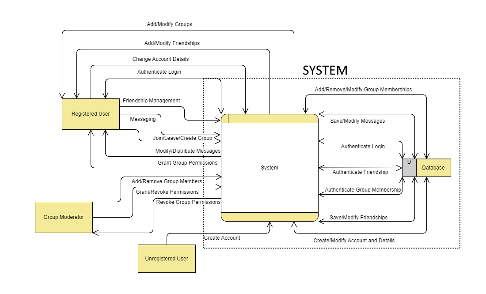
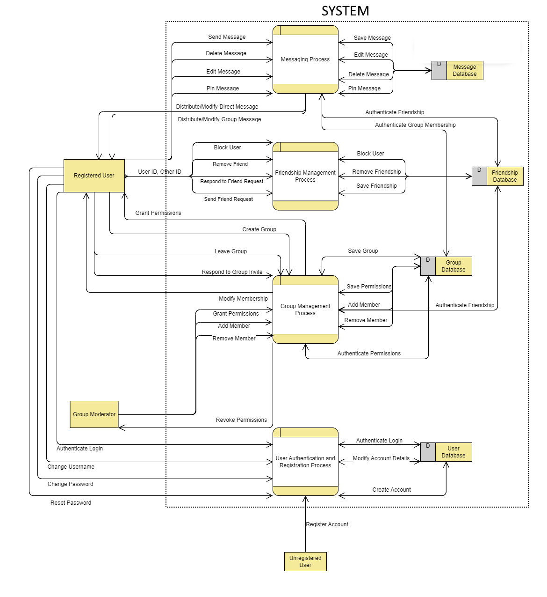
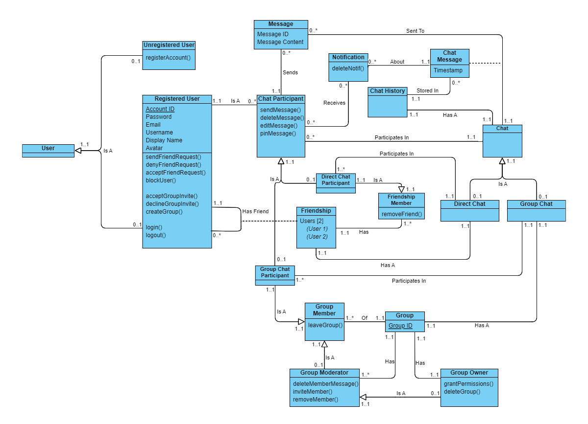

# Notice
Diagrams were made with the tools available for free at [Online Visual Paradigm](https://online.visual-paradigm.com/).

Diagrams are not finalized and may be continuously modified as necessary throughout the project.

## Diagrams
### Data Flow Diagram (Level 0)

### Data Flow Diagram (Level 1)

### UML Class Diagram with Multiplicities

## Notes
* Specific data elements were not listed for Data-Flow diagrams as they have not yet been decided. 
  A general idea of what data may be transferred can be derived from the listed tasks.
* Attributes and methods listed in the UML Class Diagram are focused mostly on the User, 
  and may be updated as more information comes to light.
* Data types and scope were not included for the UML Class Diagram; these may be decided later through exploration,
  and locking down now may be a foolhardy decision.