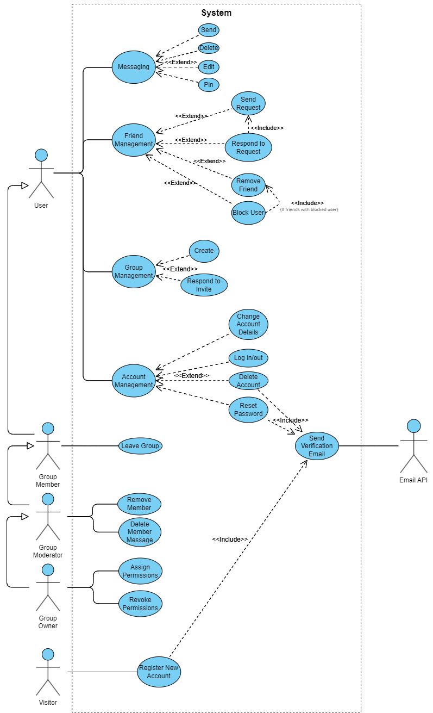

<table>
<tr>
    <th>Use Case</th>
    <th>Details</th>
    <th>Scenarios</th>
</tr>
<tr>
<td>Use Case 1. Messaging</td>
<td>

* Primary Actor: Registered User
* Precondition: User is registered and logged in
* Postcondition: Varies

</td>
<td>
1. User navigates to and opens a direct message chat or a group message chat
        <table>
<tr>

a) Send Message
1. User types a message and presses enter or "Send" button
2. Server takes message and saves it in the database
3. Message is distributed via server to recipients
4. Message is displayed for all involved clients
   
</tr>
<tr>

b) Attaching Media
1. User clicks on a paperclip icon and selects a file from their device
2. Server takes file and saves it in the database
3. Message with file is distributed via server to recipients
4. Message with file is displayed for all involved clients

</tr>
<tr>

c) Delete Message
1. User opens hamburger menu on message they've sent and clicks delete
2. User confirms they want to delete the message
3. Server locates message in database and deletes it
4. Message is removed from display for all involved clients

</tr>
<tr>

d) Edit Message
1. User opens hamburger menu on message they've sent and clicks edit
2. User makes edits to message and confirms them
3. Server locates message in database and modifies it
4. Message is edited in display for all involved clients

</tr>
<tr>

e) Pin Message
1. User clicks on a thumbtack icon and confirms they want to pin the message
2. The server locates and marks the message as pinned in the database
3. Message is displayed in a toggle-able tab with the list of pinned messages for all involved clients

</tr>
</table>
</td>
</tr>
<tr>
<td>Use Case 2. Manage Friends</td>
<td>

* Primary Actor: Registered User
* Precondition: User is registered and logged in
* Postcondition: Varies

</td>
<td>
<table>
<tr>

a) Send Friend Request
1. User navigates to and opens "Friends" tab
2. User clicks "Add friend" button and searches the username of their friend
3. User finds their profile and sends them a friend request
4. The friend request is stored in the database by the server
5. The friend sees the pending request in their own "Friends" tab

a) <u>Extensions</u>
</tr>
<tr>

1. User cancels the friend request
   * Server removes the outgoing friend request from the database

</tr>
<tr>

b) Accept Friend Request
1. User navigates to and opens "Friends" tab
2. User navigates to "Pending" tab
3. User clicks on checkmark button and confirms the friend request
4. Server deletes friend request from the database
5. Server adds the new friendship between users to database
6. Server opens a new direct chat between the users

</tr>
<tr>

c) Remove Friend
1. User navigates to friend profile
2. User clicks "Remove Friend" and confirms their choice
3. Server removes friendship from the database
4. Neither user is able to message each other anymore, but their direct chat is preserved

</tr>
<tr>

d) Block User
1. User navigates to another user's profile
2. User opens hamburger menu, selects "Block User" and confirms their choice
3. Server adds the blockship to the database
4. Neither user can send friend requests to each other
5. The blocked user cannot see the profile of the user and the user cannot see messages sent by the blocked user

d) <u>Extensions</u>
</tr>
<tr>

1. User was friend with the blocked user
   * Server removes the user's friendship with the blocked user from the database

</tr>
<tr>

2. User had pending friend request from the blocked user
   * Server removes the pending friend request from the database

</tr>
<tr>

2. User had outgoing friend request to the blocked user
    * Server removes the outgoing friend request from the database

</tr>
</table>
</td>
</tr>
<tr>
<td>Use Case 3. Manage Groups</td>
<td>

* Primary Actor: Registered User
* Precondition: User is registered and logged in
* Postcondition: Varies

</td>
<td>
<table>
<tr>

a) Create Group
1. User clicks on "Create Group" button and inputs details, confirming their choice
2. Server takes request and creates a new Group and GroupChat
3. Server sets the user as the Owner, and adds a corresponding GroupModerator and GroupMember row
3. User now sees the Group in their list of groups

</tr>
<tr>

b) Join Group
1. User navigates to "Groups" tab and opens "Invites" menu
2. User accepts invite to group
3. Server adds User as a GroupMember
4. User now sees the Group in their list of groups

</tr>
<tr>

c) Leave Group
1. User navigates into Group settings page and selects "Leave Group," confirming their choice
2. Server takes request and removes User from Group, removing corresponding database entries
3. User no longer sees the group in their list of groups

c) <u>Extensions</u>
1. User is the Group Owner
* Server assigns the oldest appointed GroupModerator as the new Owner

</tr>
</table>
</td>
</tr>
<tr>
<td>Use Case 4. Manage Group Members</td>
<td>

* Primary Actor: Group Moderator or Owner
* Precondition: User is assigned Group Moderator or is a Group Owner, User is registered and logged in
* Postcondition: Varies

</td>
<td>
<table>
<tr>

a) Invite Member(s)
1. Group Moderator selects "Invite" option when in Group Settings
2. Group Moderator selects one or more of their friends to invite
3. Server saves invitations to the database and distributes to the invited users

</tr>
<tr>

b) Remove Group Member
1. Group Moderator navigates to Member List, selects "Remove member" on a member, and confirms their choice
2. Server deletes corresponding rows for User and notifies both the removed user and the group chat that the user was removed
3. Removed user no longer sees the Group in their list of Groups

</tr>
<tr>

c) Delete Member Message
1. Group Moderator selects a member's message and opens the hamburger menu, selecting "delete"
2. Server takes request and deletes the message from the database
3. All clients in the group remove the message from view

</tr>
<tr>

d) Assigning Permissions
1. Group Owner selects a member in the member list, selects "Assign moderator", and confirms their decision
2. Server adds corresponding GroupModerator row for the Group Member
3. New Moderator can now see moderator options and privileges

</tr>
<tr>

e) Removing Permissions
1. Group Owner selects a moderator in the member list, selects "Revoke moderator", and confirms their decision
2. Server removes corresponding GroupModerator row for the Group Member
3. Member can no longer see moderator options and privileges

</tr>
</table>
</td>
</tr>
<tr>
<td>Use Case 5. Account Management</td>
<td>

* Primary Actor: Registered User
* Precondition: Varies
* Postcondition: Varies

</td>
<td>
<table>
<tr>

a) Log Into Account
1. Registered User navigates to website home page on browser
2. User enters their credentials and confirms them
3. Server checks credentials against database and opens an authenticated logged-in session
4. User is redirected to their landing page

</tr>
<tr>

b) Log Out of Account
1. Registered, logged-in User navigates to their settings
2. User selects log out
3. Server ends the authenticated logged-in session
4. User is redirected to the website home page

</tr>
<tr>

c) Change Username
1. Registered, logged-in User navigates to their settings, then to account details
2. User selects "change username" and enters a new username, confirming it
3. Server checks the new username against database entries
4. Server changes the username in the database if there are no conflicts
5. User's profile representation changes in all views for all other users and themselves

</tr>
<tr>

d) Change Avatar
1. Registered, logged-in User navigates to their settings, then to account details
2. User selects "change avatar" and selects a new avatar, confirming it
3. Server saves the new avatar in the database
4. User's profile representation changes in all views for all other users and themselves

</tr>
<tr>

e) Change Description
1. Registered, logged-in User navigates to their settings, then to account details
2. User selects "change description" and types a new description, confirming it
3. Server saves the new description in the database
4. User's profile representation changes in all views for all other users and themselves

</tr>
<tr>

f) Change Password
1. Registered, logged-in User navigates to their settings, then to account details
2. User selects "change password" enters their old password and a new password twice, confirming it
3. Server sends a validation email to their registered email and awaits response
4. User navigates to email and confirms by clicking the link
5. Server changes the password in the database for the user and redirects the user back to settings

</tr>
<tr>

g) Reset Password
1. Registered User selects "Reset Password" from log-in screen
2. Server sends email with Reset Password link to user's registered email
3. User navigates to email and confirms by clicking the link
4. User enters their new password twice, and confirms
5. Server saves new password in the database and sends a confirmation email
6. User is redirected to log-in page to try logging in with their new password

</tr>
<tr>

h) Change Email
1. Registered, logged-in User navigates to their settings, then to account details
2. User selects "change email", enters their password and new email, confirms it
3. Server sends validation email to both old email and new email and awaits response
4. User navigates to both emails and confirms by clicking the links
5. Server changes the email in the database for the user and redirects the user back to settings

</tr>
<tr>

i) Delete Account
1. Registered, logged-in User navigates to their settings, then to account details
2. User selects "delete account", enters their password, confirms their decision
3. Server sends validation email to registered email
4. User navigates to email and confirms by clicking the link
5. Server deletes all user records except for messaging, where only their identification is removed
 
</tr>
</table>
</td>
</tr>
<tr>
<td>Use Case 6. Registration</td>
<td>

* Primary Actor: Visitor
* Precondition: None
* Postcondition: A new Registered User is created

</td>
<td>
<table>
<tr>

1. Visitor navigates to sign-up screen
2. Visitor adds their desired credentials, e.g., Username, Email, Password (twice). 
3. Visitor confirms their details. Server checks their Username and Email against the database.
4. If there are no conflicts, the Server sends a validation email to the specified email.
5. Visitor navigates to the email and confirms by clicking the link.
6. Server creates the new User's account and record in the User table, with the link automatically logging the user in.

</tr>
</table>
</td>
</tr>
</table>
